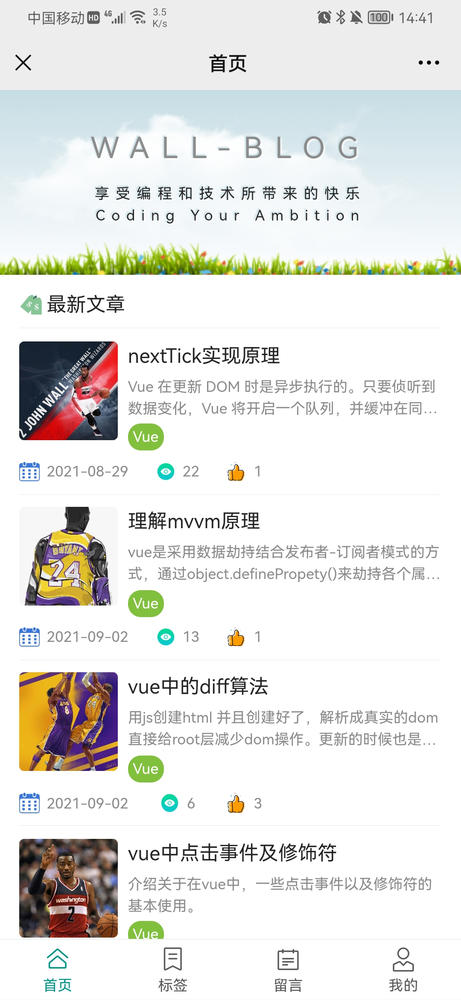
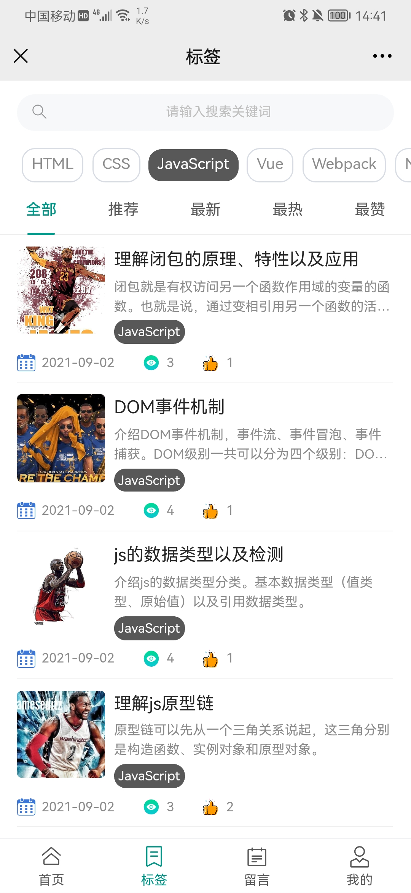
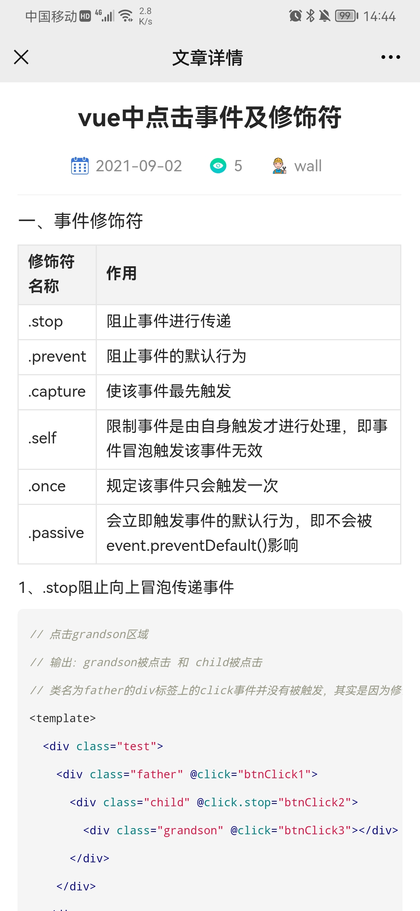
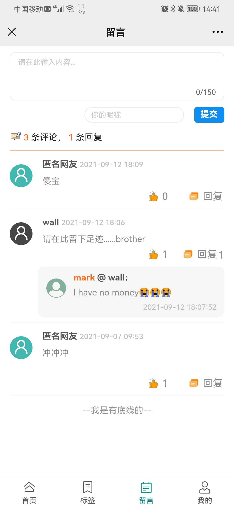
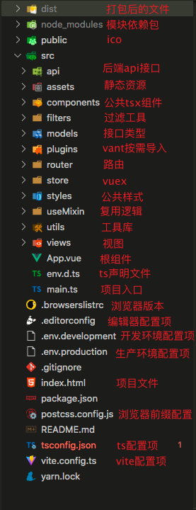

# vue3-vite2-blog-h5

一款简约的移动端博客。前端项目主要是采用`Vue3`语法糖`<script setup>`和`Vant3.0`来搭建的；采用`Tsx`来渲染公共组件；采用`Vite2.0`来构建、打包。后端项目主要采用`Node`框架`Koa2`以及`MongoDB`数据库来设计的。

1. Vue2 Node PC 版本仓库地址：[https://github.com/Sujb-sus/vue-node-mongodb-blog](https://github.com/Sujb-sus/vue-node-mongodb-blog)
2. React Hooks H5 版本仓库地址：[https://github.com/Sujb-sus/react-hooks-blog-h5](https://github.com/Sujb-sus/react-hooks-blog-h5)

## 项目预览





## 项目结构



## 技术运用

### 一、rem 适配

1. 安装插件`yarn add amfe-flexible postcss-pxtorem -S`

- `amfe-flexible`是配置可伸缩布局方案，主要是将 1 rem 设为 viewWidth / 10
- `postcss-pxtorem`是 postcss 的插件，用于将像素（px）单元生成 rem 单位

2. 在 main.ts 导入`amfe-flexible`

```typescript
import 'amfe-flexible';
```

3. 在`postcss.config.js`配置`postcss-pxtorem`

```typescript
module.exports = {
  plugins: {
    'postcss-pxtorem': {
      rootValue: 37.5,
      propList: ['*'],
    },
  },
};
```

- rootValue 根据设计稿宽度除以 10 进行设置，这边假设设计稿为 375，即 rootValue 设为 37.5
- propList 是设置需要转换的属性，这边\*意思就是为所有单位为（px）都进行转换

### 二、添加 css 前缀

1. 安装插件`yarn add autoprefixer -D`
2. 在`postcss.config.js`配置`autoprefixer`

```typescript
module.exports = {
  plugins: {
    autoprefixer: {
      overrideBrowserslist: ['Android 4.1', 'iOS 7.1'],
      grid: true,
    },
  },
};
```

- overrideBrowserslist：浏览器的兼容配置
- grid: true 为 IE 启用网格布局前缀

### 三、公共组件用 tsx 语法编写

```typescript
// svgIcon.tsx
import { defineComponent, computed } from 'vue';

export default defineComponent({
  name: 'svgIcon',
  props: {
    name: {
      type: String,
      required: true,
    },
  },
  setup(props) {
    const iconName = computed(() => `#${props.name}`);
    return () => (
      <>
        <svg class="icon" aria-hidden="true">
          <use xlinkHref={iconName.value}></use>
        </svg>
      </>
    );
  },
});
```

- defineComponent 对 setup 函数进行封装，返回 options 的对象，在 ts 下给予了组件正确的参数类型推断
- `<use xlink:href={iconName.value}>`需要改为驼峰形式`<use xlinkHref={iconName.value}>`，不然会有语法问题

### 四、用`<script setup>`语法糖

#### 1. 父组件传值给子组件

```html
<!-- 父组件的html  -->
<List :showTitle="false" :params="params"></List>
```

```typescript
// 子组件的<script setup>
interface Props {
  showTitle?: boolean;
  params?: object;
}
const props = withDefaults(defineProps<Props>(), {
  showTitle: true,
  params: undefined,
});
```

- `defineProps`定义 props 类型
- `withDefaults`提供 props 默认值
- 两者在`<script setup>`内不需要额外导入即可使用

#### 2. 子组件传值给父组件

```html
<!-- 父组件的html -->
<LabelSelect @changeLabel="changeLabel" ref="label"></LabelSelect>
```

```typescript
// 父组件的<script setup>
const changeLabel = (labelName: string) => {
  params.type = labelName;
};
```

```typescript
// 子组件的<script setup>
const emit = defineEmits(['changeLabel']);
emit('changeLabel', labelName);
```

- `defineEmits`定义响应父组件的方法名，需要先定义才可通过 emit()响应
- `emit('changeLabel', data)`，changeLabel 为响应的方法名，labelName 就是要传给父组件的值

#### 3. 逻辑复用

- 用 use...以驼峰的形式开头定义文件，定义一个 useClickLike 函数且导出；

```typescript
// useClickLikes.ts
import { ref, computed } from 'vue';
import { Toast } from 'vant';

/**
 * 封装点赞逻辑
 * @requestApi api请求的path
 * @description 点赞文章、留言
 */
const useClickLike = (requestApi: Function) => {
  let likeList = ref<string[]>([]); // 点过赞列表

  // 点赞事件
  const handleLikes = (id: string) => {
    return requestApi({ _id: id, isLike: likeList.value.includes(id) })
      .then(() => {
        likeList.value.includes(id)
          ? likeList.value.splice(likeList.value.indexOf(id), 1)
          : likeList.value.push(id);
      })
      .catch((err: any) => {
        Toast('点赞失败');
        console.log(err);
      });
  };

  return {
    getLikesNumber,
    getLikesColor,
    handleLikes,
    likeList,
  };
};

export default useClickLike;
```

- 在 vue 文件中引用，先导入进来，再解构出所需要的函数逻辑

```typescript
import useClickLike from '@/useMixin/useClickLike';
// 点赞逻辑
const { handleLikes } = useClickLike(apiUpdateLikes);
```

- handleLikes 就可以在 html 模版直接运用

```html
<div class="footer-item" @click.stop="handleLikes(item._id)"></div>
```

#### 4. computed、watch 的使用

```typescript
import { computed, watch } from 'vue'

// 获取点赞数
  const getLikesNumber = computed(
    () => (id: string, likes: number) =>
      likeList.value.includes(id) ? likes + 1 : likes
  );
// 监听参数
watch(props.params, (newVal，oldVal) => {
    pageindex.value = 1
    hasLoad.value = false
    loading.value = false
    finished.value = false
    list.value = []
    getBlogList()
  })
```

- computed 语法：id 和 likes 为 getLikesNumber 的形参
- watch 语法：props.params 为监听对象，newVal 为监听到的最新值，oldVal 为旧值

#### 5. vuex 的使用

```typescript
import { useStore } from 'vuex';

const store = useStore();
// 获取label模块actions下的getLabelList方法
const getLabelList = () => store.dispatch('label/getLabelList');
getLabelList(); // 直接执行方法
// 获取label模块getters下的labelList属性
const labelList = store.getters['label/labelList'];
```

#### 6. vue-router 的使用

- 配置路由文件，`createWebHashHistory`制定 hash 模式
- `/:pathMatch(.*)*`匹配所有路由做重定向用
- 导入路由文件需要用`import.meta.glob`，不能用直接用`import`导入，`import`在开发时没问题，但是在打包后的文件会识别不了路由文件

```typescript
import { createRouter, createWebHashHistory, RouteRecordRaw } from 'vue-router';
import Tabbar from '../components/tabbar';
// 先识别所有的views/文件夹name/*.vue文件
// 这里限制性很高，只有路径为/views/文件夹name/*.vue，的文件才能背识别
const modules = import.meta.glob('../views/*/*.vue');
const loadComponent = (component: string) =>
  modules[`../views/${component}.vue`];

const routes: Array<RouteRecordRaw> = [
  {
    path: '/home',
    component: loadComponent('home/index'),
    meta: {
      title: '首页',
    },
  },
  // ...
  {
    path: '/:pathMatch(.*)*',
    redirect: '/home',
  },
];

const router = createRouter({
  history: createWebHashHistory(),
  routes,
});

export default router;
```

- 获取路由携带的 query 参数

```typescript
import { useRouter } from 'vue-router';
const route = useRouter();
const id = route.currentRoute.value.query['id'];
```

## 后端服务

必须得先开启后端服务接口，连接上`MongoDB`数据库，不然前端项目没法预览。这边的服务接口其实是复用了 PC 端`wall-blog`项目的接口。所以如果想要在管理后台添加数据的，需要移至该仓库：[https://github.com/Sujb-sus/vue-node-mongodb-blog](https://github.com/Sujb-sus/vue-node-mongodb-blog)。

该仓库下共有三个项目，PC 管理端（admin）、PC 客户端（client）、后台服务端（server）。`server`项目其实就是本项目的`server`目录，为了方便大家的预览，我 Copy 了一份过来。

- client：博客的 PC 端
- admin：博客的管理端，就是用来添加文章数据、标签数据等等
- server：给博客提供接口服务数据

### 开启后端接口服务

#### 方式一、移至上述所说的仓库地址

该仓库下有详细的描述，主要流程如下：

1. 查看注意事项，先安装、连接好本地的`MongoDB`数据库，开启服务
2. 启动`admin`项目，就可以通过管理后台手动添加数据了

#### 方式二、直接在本项目连接`MongoDB`数据库

1. 项目启动前，需要在本地安装好`MongoDB`数据库；

2. 在`server/config.js`文件配置数据库名、用户以及密码等一些必要的信息；这些信息都可以自定义，但是需要跟`步骤3`同步起来；

```js
// server/config.js
export default {
  env: process.env.NODE_ENV,
  port,
  auth,
  log,
  mongodb: {
    username: 'wall', // 数据库用户
    pwd: 123456, // 数据库密码
    address: 'localhost:27017',
    db: 'wallBlog', // 数据库名
  },
};
```

3. 启动本地的`mongo`服务，给数据库初始化在`server/config.js`配置的一些必要信息；

```js
> mongo // 开启mongo服务
> show dbs // 显示数据库列表
> use wallBlog // 新建一个wallBlog数据库
> db.createUser({user:"wall",pwd:"123456",roles:[{role:"readWrite",db:'wallBlog'}]}) // 在wallBlog数据库创建一个wall用户，密码为123456
> show users // 展示该库有哪些用户
> db.auth("wall", "123456"); // 数据库认证一下用户、密码，返回 1 认证成功
```

4. 进入`server`目录，安装依赖，并开启服务

```js
cd server // 进入server目录
yarn // 安装依赖包
yarn server // 开启后端接口，成功了便会提示数据库连接成功
```

## 注意事项

1. `env.d.ts`文件：用 ts 写的模块在发布的时候仍然是用 js 发布，所以需要一个 d.ts 文件来标记某个 js 库里面对象的类型
2. `models/index.ts`文件：用来定义接口返回的数据的类型，每个数据的类型都需要定义，不然在打包 vue 文件的 html 渲染数据时会有问题；导出需要用`export type {...}`格式导出
3. `components/noData.tsx`文件：引用静态图片时，需要用模块导入的形式导入进来，直接在 html 使用图片路径在打包时，不会自动解析该图片路径
4. `styles/common/iphone_x.scss`文件：提供了适配 iPhonex 全面屏系列的底部间距
5. `tsconfig.json`文件：strict：true 开启所有严格类型检查
6. `icon`用的是阿里巴巴矢量图标库，采用`Symbol`的形式引入项目。先在图标库中以`Symbol`的方式生成一个在线链接，再通过`<script>`直接引入在`index.html`

## 参考文档

1. ts 中文文档：[https://www.tslang.cn/docs/handbook/compiler-options.html](https://www.tslang.cn/docs/handbook/compiler-options.html)
2. vite 中文文档：[https://cn.vitejs.dev/config/](https://cn.vitejs.dev/config/)
